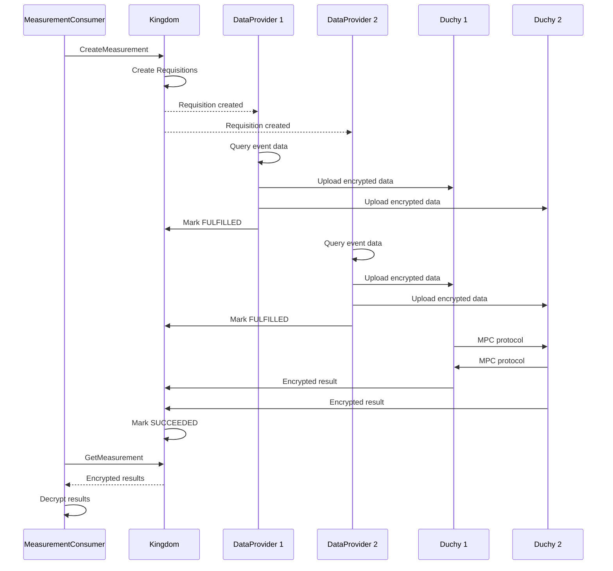

## Overview

The Cross-Media Measurement API enables privacy-preserving measurement across multiple data providers using multi-party computation. This page explains the core concepts, architecture, and terminology you need to understand to work effectively with the API.

## Architecture

The Cross-Media Measurement system consists of four primary components that work together to enable privacy-preserving measurements:

### Kingdom

The **Kingdom** is the central coordination service that:

- Manages all API resources (MeasurementConsumers, DataProviders, Measurements, etc.)
- Orchestrates the measurement workflow
- Creates Requisitions when Measurements are requested
- Distributes computation work to Duchies
- Returns encrypted results to MeasurementConsumers

<Note>
  The Kingdom never sees raw user-level data. It only coordinates the measurement process and manages metadata.
</Note>

### Duchies

Duchies are independent computation nodes that perform multi-party computation:

- Multiple Duchies work together to compute measurement results
- Each Duchy only sees encrypted shares of the data
- No single Duchy can reconstruct the original data
- Duchies are operated by independent entities to maintain trust

<Warning>
  The security model requires that not all Duchies collude. As long as at least one Duchy is honest, user privacy is preserved.
</Warning>

### Data Providers (EDPs)

Data Providers are entities that contribute event data for measurements:

- **Publishers** - Media companies with impression/view data
- **Panel Providers** - Research companies with panel data
- Each Data Provider fulfills Requisitions by encrypting and uploading data
- Data is encrypted such that only Duchies can process it

### Measurement Consumers

Measurement Consumers request and consume measurement results:

- **Advertisers** - Brands measuring campaign effectiveness
- **Agencies** - Media agencies measuring for clients
- **Researchers** - Academic or market researchers

Consumers create Measurements and receive encrypted results that only they can decrypt.

## Resource Model

The API follows a resource-oriented design. Understanding the relationships between resources is key to using the API effectively.

### Core Resources

#### MeasurementConsumer

A consumer of measurement results (advertiser, agency, etc.).

```protobuf
message MeasurementConsumer {
  string name = 1;                    // Resource name
  bytes certificate_der = 2;          // X.509 certificate in DER format
  string certificate = 3;             // Certificate resource name
  SignedMessage public_key = 4;       // Encryption public key
  string display_name = 5;            // Human-readable name
  repeated string owners = 6;         // Owner Account resources
}
```

**Resource name pattern**: `measurementConsumers/{measurement_consumer}`

Key fields:
- `certificate_der` - X.509 certificate used to verify signatures
- `public_key` - Encryption public key for receiving encrypted results
- `owners` - Account resources that have permission to manage this MeasurementConsumer

#### DataProvider

A provider of event data (publisher, panel provider, etc.).

```protobuf
message DataProvider {
  string name = 1;                          // Resource name
  bytes certificate_der = 2;                // X.509 certificate
  SignedMessage public_key = 3;             // Encryption public key
  string display_name = 4;
  repeated string required_duchies = 5;     // Duchies required for this EDP
  Capabilities capabilities = 6;            // Supported protocols
  repeated DataAvailabilityMapEntry data_availability_intervals = 7;
}
```

**Resource name pattern**: `dataProviders/{data_provider}`

Key fields:
- `required_duchies` - Specific Duchies that must participate when this DataProvider is involved
- `capabilities` - Indicates which MPC protocols this DataProvider supports
- `data_availability_intervals` - Time ranges when data is available by ModelLine

#### Measurement

A measurement request computing reach, frequency, impressions, or other metrics.

```protobuf
message Measurement {
  string name = 1;
  string measurement_consumer_certificate = 2;
  SignedMessage measurement_spec = 3;       // Signed MeasurementSpec
  repeated DataProviderEntry data_providers = 4;
  ProtocolConfig protocol_config = 5;
  State state = 6;                          // Current state
  repeated ResultOutput results = 8;        // Encrypted results
  Failure failure = 10;                     // Set if state = FAILED
}
```

**Resource name pattern**: `measurementConsumers/{measurement_consumer}/measurements/{measurement}`

Measurement states:
- `AWAITING_REQUISITION_FULFILLMENT` - Waiting for DataProviders to fulfill Requisitions
- `COMPUTING` - Duchies are performing computation
- `SUCCEEDED` - Complete, results available
- `FAILED` - Failed with error details in `failure` field
- `CANCELLED` - Cancelled by MeasurementConsumer

#### Requisition

A request for data from a specific DataProvider for a Measurement.

```protobuf
message Requisition {
  string name = 1;
  string measurement = 2;                       // Parent Measurement
  SignedMessage measurement_spec = 3;
  EncryptedMessage encrypted_requisition_spec = 4;  // Encrypted RequisitionSpec
  repeated DuchyEntry duchies = 5;
  State state = 6;
  Refusal refusal = 7;                          // Set if state = REFUSED
}
```

**Resource name pattern**: `dataProviders/{data_provider}/requisitions/{requisition}`

Requisition states:
- `UNFULFILLED` - Not yet fulfilled by DataProvider
- `FULFILLED` - DataProvider has provided data
- `REFUSED` - DataProvider declined to fulfill (with justification)
- `WITHDRAWN` - Cancelled by system

<Note>
  Requisitions are created automatically by the Kingdom when a Measurement is created. DataProviders cannot create Requisitions directly.
</Note>

#### EventGroup

A grouping of events defined by a DataProvider (e.g., a campaign or creative).

```protobuf
message EventGroup {
  string name = 1;
  string measurement_consumer = 2;          // Associated MeasurementConsumer
  string event_group_reference_id = 3;
  repeated MediaType media_types = 4;
  EventGroupMetadata event_group_metadata = 5;
  google.type.Interval data_availability_interval = 6;
  State state = 7;                          // ACTIVE or DELETED
}
```

**Resource name pattern**: `dataProviders/{data_provider}/eventGroups/{event_group}`

Key concepts:
- EventGroups organize events by campaign, creative, or other logical grouping
- `measurement_consumer` links the EventGroup to a specific advertiser/agency
- `data_availability_interval` specifies when events are available
- `event_group_metadata` contains campaign identifiers and metadata

### Supporting Resources

#### Certificate

An X.509 certificate used for digital signatures and verification.

```protobuf
message Certificate {
  string name = 1;
  bytes x509_der = 2;                      // Certificate in DER format
  google.protobuf.Timestamp not_valid_before = 3;
  google.protobuf.Timestamp not_valid_after = 4;
  RevocationState revocation_state = 5;
}
```

Certificates can be:
- Created for MeasurementConsumers, DataProviders, and Duchies
- Revoked if compromised
- Placed on HOLD temporarily

#### ApiKey

An authentication key for service-to-service API access.

```protobuf
message ApiKey {
  string name = 1;
  string nickname = 2;
  string description = 3;
  string authentication_key = 4;  // Only in CreateApiKey response
}
```

**Resource name pattern**: `measurementConsumers/{measurement_consumer}/apiKeys/{api_key}`

<Warning>
  The `authentication_key` is only returned when creating the ApiKey. Store it securely - it cannot be retrieved later.
</Warning>

## Measurement Workflow

Understanding the end-to-end workflow helps you understand how the components interact:

<Steps>
  <Step title="MeasurementConsumer creates a Measurement">
    The MeasurementConsumer calls `CreateMeasurement` with:
    - Signed `MeasurementSpec` defining the metric (reach, frequency, etc.)
    - List of DataProviders to include
    - Differential privacy parameters
    - VID sampling interval
  </Step>
  
  <Step title="Kingdom creates Requisitions">
    The Kingdom automatically creates one Requisition per DataProvider, each containing:
    - Encrypted `RequisitionSpec` with EventGroup details
    - Collection interval (time range)
    - Filter criteria
  </Step>
  
  <Step title="DataProviders fulfill Requisitions">
    Each DataProvider:
    - Receives notification of new Requisition
    - Decrypts the RequisitionSpec
    - Queries their event data matching the criteria
    - Encrypts the data for each Duchy
    - Uploads encrypted data to Duchies
    - Marks Requisition as FULFILLED
  </Step>
  
  <Step title="Duchies perform computation">
    Once all Requisitions are fulfilled:
    - Duchies coordinate to perform multi-party computation
    - No Duchy sees raw data - only encrypted shares
    - Differential privacy noise is added during computation
    - Result is encrypted with MeasurementConsumer's public key
  </Step>
  
  <Step title="MeasurementConsumer retrieves results">
    The Kingdom marks the Measurement as SUCCEEDED and:
    - Stores encrypted results in the Measurement
    - MeasurementConsumer polls or gets notified
    - Consumer decrypts results with their private key
    - Processes the reach, frequency, or other metrics
  </Step>
</Steps>



## Key Terminology

### Privacy & Security Terms

**Multi-Party Computation (MPC)**
: A cryptographic protocol that allows multiple parties to jointly compute a function while keeping their inputs private. In this API, Duchies use MPC to compute measurements without seeing raw user data.

**Differential Privacy**
: A mathematical framework for privacy that adds calibrated noise to results. This prevents inference attacks even when multiple measurements are combined.

**Epsilon (ε)**
: The privacy budget parameter in differential privacy. Lower values provide stronger privacy but less accuracy. Typical values: 0.001 to 1.0.

**Delta (δ)**
: The failure probability in differential privacy. Represents the probability that privacy is not preserved. Typically set to 1e-12 or smaller.

**Virtual ID (VID)**
: A pseudonymous identifier used to represent users across systems. VIDs enable cross-provider measurement while preserving privacy.

### Measurement Terms

**Reach**
: The number of unique users (VIDs) who had at least one impression event. This is the count of distinct individuals reached.

**Frequency**
: A distribution showing how many times each user was exposed. For example, "30% of users saw the ad exactly 3 times."

**Impression**
: A single event representing an ad view, video view, or other exposure.

**Watch Duration**
: Total time spent watching video content, aggregated across all users.

**Population**
: The size of a user population, used as a denominator for computing rates.

### Protocol Terms

**Liquid Legions v2**
: An MPC protocol for computing reach and frequency using homomorphic encryption and secure sketches.

**Reach-Only Liquid Legions v2**
: An optimized variant of Liquid Legions v2 for computing only reach (not frequency).

**Honest Majority Share Shuffle (HMSS)**
: An MPC protocol that assumes an honest majority of participants and uses secret sharing for efficiency.

**Deterministic Count/Sum**
: Direct computation methods where a single DataProvider computes the result without MPC.

### Resource Terms

**ModelLine**
: A specific VID model configuration used for a measurement. Different ModelLines may use different matching algorithms.

**RequisitionSpec**
: A specification defining which events should be included in a Requisition (time range, EventGroups, filters).

**MeasurementSpec**
: A specification defining the measurement type, privacy parameters, and VID sampling.

**Nonce**
: A random number used once to prevent replay attacks and ensure uniqueness.

**SignedMessage**
: A message with a digital signature that can be verified using an X.509 certificate.

**EncryptedMessage**
: A message encrypted using public key encryption, which can only be decrypted by the holder of the corresponding private key.

## Advanced Concepts

### VID Sampling

To reduce computation costs, you can sample a subset of VIDs:

```protobuf
message VidSamplingInterval {
  float start = 1;  // 0.0 to 1.0
  float width = 2;  // 0.0 to 1.0
}
```

Example: `start=0.0, width=0.1` samples 10% of VIDs.

<Note>
  When using VID sampling, scale up the reach result by `1 / width` to estimate total reach.
</Note>

### Noise Mechanisms

Different protocols use different noise mechanisms:

- **GAUSSIAN** - Adds Gaussian (normal) noise
- **DISCRETE_GAUSSIAN** - Adds discrete Gaussian noise (integer values)
- **LAPLACE** - Adds Laplace noise (rare in this API)

The `noise_mechanism` field in results indicates which was used.

### Data Availability

DataProviders specify when data is available using intervals:

```protobuf
message DataAvailabilityMapEntry {
  string key = 1;    // ModelLine resource name
  google.type.Interval value = 2;  // Availability interval
}
```

Measurements can only be created for time periods within the DataProvider's availability window.

### Certificate Preference

When multiple certificates exist, preference is determined by:

1. Not revoked (highest priority)
2. Within validity period
3. Later expiration date
4. Later start date (lowest priority)

## Best Practices

### Privacy Budget Management

<Warning>
  Each measurement consumes privacy budget. Repeated measurements on the same population can lead to privacy degradation.
</Warning>

Best practices:
- Use higher epsilon (e.g., 0.1) for exploratory analysis
- Use lower epsilon (e.g., 0.001) for final reporting
- Limit the number of measurements on the same time period and population

### Error Handling

Measurements can fail for various reasons:

```protobuf
message Failure {
  enum Reason {
    CERTIFICATE_REVOKED = 1;
    REQUISITION_REFUSED = 2;
    COMPUTATION_PARTICIPANT_FAILED = 3;
  }
  Reason reason = 1;
  string message = 2;
}
```

Always check the `failure` field when `state = FAILED`.

### Resource Naming

Resource names follow consistent patterns:

- `measurementConsumers/{mc_id}/measurements/{measurement_id}`
- `dataProviders/{dp_id}/eventGroups/{event_group_id}`
- `dataProviders/{dp_id}/requisitions/{requisition_id}`

Use these patterns when constructing resource references.

## Next Steps

Now that you understand the core concepts, explore:

<CardGroup cols={2}>
  <Card title="Resource Model" icon="diagram-project" href="/concepts/resource-model">
    Detailed resource relationships and hierarchies
  </Card>
  <Card title="Measurements" icon="chart-line" href="/concepts/measurements">
    Deep dive into measurement types and specifications
  </Card>
  <Card title="Multi-Party Computation" icon="shield-halved" href="/concepts/multi-party-computation">
    How MPC protocols work in detail
  </Card>
  <Card title="Creating Measurements" icon="rocket" href="/guides/creating-measurements">
    Practical guide to creating measurements
  </Card>
</CardGroup>
