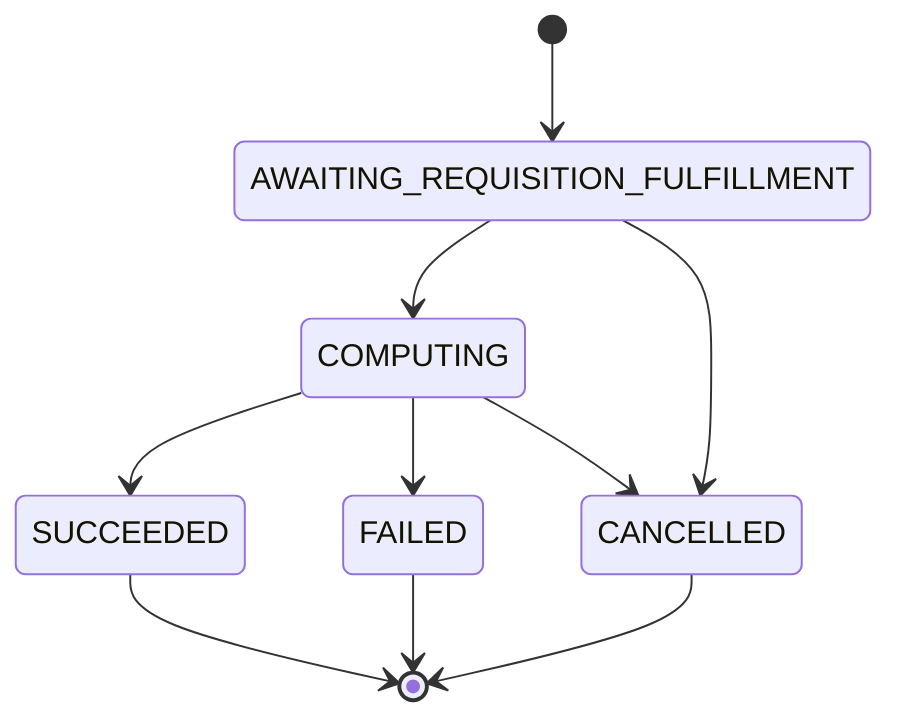

## Overview

A **Measurement** represents a privacy-preserving computation requested by a MeasurementConsumer to analyze event data across multiple DataProviders. Measurements enable cross-media analytics while protecting individual user privacy through differential privacy and multi-party computation.

## Measurement Types

The API supports five core measurement types, each designed for specific analytics use cases:

### Reach

Measures the number of unique users (VIDs) who were exposed to impression events.

```protobuf
message Reach {
  int64 value = 1;  // Must be non-negative
  ProtocolConfig.NoiseMechanism noise_mechanism = 2;
  oneof methodology {
    LiquidLegionsCountDistinct liquid_legions_count_distinct = 5;
    LiquidLegionsV2Methodology liquid_legions_v2 = 6;
    ReachOnlyLiquidLegionsV2Methodology reach_only_liquid_legions_v2 = 7;
    HonestMajorityShareShuffleMethodology honest_majority_share_shuffle = 8;
  }
}
```

**Use Cases:**
- Campaign reach analysis
- Unique audience measurement
- Cross-publisher deduplication

<Info>
Reach values are always non-negative. Negative values from differential privacy noise are automatically clamped to 0.
</Info>

### Reach and Frequency

Measures both unique reach and the distribution of how many times users were exposed.

```protobuf
message Frequency {
  // Map of frequency → reach ratio
  // {4: 0.333} means 33.3% of users saw exactly 4 impressions
  // (or at least 4 if 4 is the maximum frequency)
  map<int64, double> relative_frequency_distribution = 1;
  ProtocolConfig.NoiseMechanism noise_mechanism = 2;
  oneof methodology {
    LiquidLegionsDistribution liquid_legions_distribution = 5;
    LiquidLegionsV2Methodology liquid_legions_v2 = 6;
    HonestMajorityShareShuffleMethodology honest_majority_share_shuffle = 7;
  }
}
```

**MeasurementSpec Configuration:**
```protobuf
message ReachAndFrequency {
  DifferentialPrivacyParams reach_privacy_params = 1;
  DifferentialPrivacyParams frequency_privacy_params = 2;
  int32 maximum_frequency = 3;  // Max frequency bucket
}
```

**Use Cases:**
- Frequency capping analysis
- Effective frequency optimization
- Multi-touch attribution preparation

<Tip>
The last frequency bucket represents "at least N" impressions, where N is the maximum_frequency.
</Tip>

### Impression

Counts the total number of impression events across all users.

```protobuf
message Impression {
  int64 value = 1;  // Total impression count
  ProtocolConfig.NoiseMechanism noise_mechanism = 2;
  oneof methodology {
    CustomDirectMethodology custom_direct_methodology = 3;
    DeterministicCount deterministic_count = 4;
  }
}
```

**MeasurementSpec Configuration:**
```protobuf
message Impression {
  DifferentialPrivacyParams privacy_params = 1;
  int32 maximum_frequency_per_user = 2;  // Cap per user
}
```

**Use Cases:**
- Total delivery verification
- CPM calculations
- Campaign pacing

### Watch Duration

Measures total watch time across all users for video content.

```protobuf
message WatchDuration {
  google.protobuf.Duration value = 1;  // Total duration
  ProtocolConfig.NoiseMechanism noise_mechanism = 2;
  oneof methodology {
    CustomDirectMethodology custom_direct_methodology = 3;
    DeterministicSum deterministic_sum = 4;
  }
}
```

**MeasurementSpec Configuration:**
```protobuf
message Duration {
  DifferentialPrivacyParams privacy_params = 1;
  google.protobuf.Duration maximum_watch_duration_per_user = 4;
}
```

**Use Cases:**
- Total viewing time analysis
- Engagement metrics
- Content performance measurement

### Population

Measures the total population size without privacy noise.

```protobuf
message Population {
  int64 value = 1;
  oneof methodology {
    DeterministicCount deterministic_count = 2;
  }
}
```

**Use Cases:**
- Panel size verification
- Universe estimation
- Denominator for reach calculations

<Note>
Population measurements do not include differential privacy noise since they measure aggregate totals, not individual-level data.
</Note>

## Measurement Lifecycle

Measurements progress through a well-defined state machine:



### State Descriptions

**AWAITING_REQUISITION_FULFILLMENT**
- Initial state when a Measurement is created
- Waiting for all linked Requisitions to be fulfilled by DataProviders
- DataProviders encrypt and upload their event data during this phase

**COMPUTING**
- All Requisitions have been fulfilled
- Duchies are performing multi-party computation
- No individual DataProvider can see other providers' data
- Differential privacy noise is being applied

**SUCCEEDED** (Terminal)
- Computation completed successfully
- Results are encrypted and available in the `results` field
- MeasurementConsumer can decrypt results using their private key

**FAILED** (Terminal)
- Computation could not complete
- The `failure` field contains details about why it failed
- Common reasons: certificate revoked, requisition refused, computation error

**CANCELLED** (Terminal)
- MeasurementConsumer cancelled the measurement
- No results will be produced

## Creating a Measurement

When creating a Measurement, you must provide:

### 1. MeasurementSpec

The specification defines what to measure:

```protobuf
message MeasurementSpec {
  google.protobuf.Any measurement_public_key = 10;
  repeated bytes nonce_hashes = 2;
  VidSamplingInterval vid_sampling_interval = 3;
  
  oneof measurement_type {
    ReachAndFrequency reach_and_frequency = 4;
    Impression impression = 5;
    Duration duration = 6;
    Reach reach = 7;
    Population population = 8;
  }
  
  string model_line = 9;
}
```

**Key Fields:**
- `measurement_public_key`: Encryption key for results
- `nonce_hashes`: Security nonces from DataProviderEntries
- `vid_sampling_interval`: VID sampling range [0.0, 1.0]
- `measurement_type`: One of the five measurement types with privacy parameters
- `model_line`: The VID model to use for identity resolution

### 2. DataProviderEntries

Specifies which DataProviders and EventGroups to measure:

```protobuf
message DataProviderEntry {
  string key = 1;  // DataProvider resource name
  
  message Value {
    string data_provider_certificate = 1;
    google.protobuf.Any data_provider_public_key = 6;
    EncryptedMessage encrypted_requisition_spec = 5;
    bytes nonce_hash = 4;
  }
  Value value = 2;
}
```

<Info>
Each DataProviderEntry contains an encrypted RequisitionSpec that specifies which EventGroups to include and the collection time interval.
</Info>

### 3. Certificate

Reference to the MeasurementConsumer's certificate for signature verification:

```protobuf
string measurement_consumer_certificate = 2;
```

## VID Sampling

VID sampling allows measuring a subset of users for efficiency:

```protobuf
message VidSamplingInterval {
  float start = 1;  // Start of interval [0.0, 1.0]
  float width = 2;  // Width of interval, ≤ 1.0
}
```

**Examples:**
- `{start: 0.0, width: 1.0}` - Include all users (100% sample)
- `{start: 0.0, width: 0.1}` - Include 10% of users
- `{start: 0.8, width: 0.5}` - Wrapping interval: [0.8, 1.0] ∪ [0.0, 0.3]

<Tip>
Interval wrapping is supported in some protocols like HMSS, allowing flexible sampling strategies.
</Tip>

## Measurement Results

Results are encrypted and signed for security:

```protobuf
message ResultOutput {
  EncryptedMessage encrypted_result = 3;
  string certificate = 2;  // Certificate of result producer
}
```

**Decryption Process:**
1. Retrieve the `encrypted_result` from the Measurement
2. Decrypt using the MeasurementConsumer's private key (corresponding to `measurement_public_key`)
3. Verify the signature using the `certificate`
4. Deserialize to get the `Result` message

<Note>
Multiple `ResultOutput` entries may be present for different computation stages or verification purposes.
</Note>

## Failure Handling

When a Measurement fails, examine the `failure` field:

```protobuf
message Failure {
  enum Reason {
    REASON_UNSPECIFIED = 0;
    CERTIFICATE_REVOKED = 1;
    REQUISITION_REFUSED = 2;
    COMPUTATION_PARTICIPANT_FAILED = 3;
  }
  Reason reason = 1;
  string message = 2;  // Human-readable context
}
```

**Common Failure Scenarios:**

| Reason | Description | Resolution |
|--------|-------------|------------|
| `CERTIFICATE_REVOKED` | A certificate was revoked | Check certificate status, re-create with valid certificate |
| `REQUISITION_REFUSED` | DataProvider refused to fulfill | Check refusal justification in Requisition |
| `COMPUTATION_PARTICIPANT_FAILED` | Duchy computation failed | Retry or contact system administrator |

## Protocol Selection

The system automatically selects an appropriate computation protocol based on:

- Measurement type
- DataProvider capabilities
- Available Duchies
- Privacy parameters

Selected protocol is available in `protocol_config` (output-only field).

**Supported Protocols:**
- **Liquid Legions V2**: Reach and frequency MPC protocol
- **Reach-Only Liquid Legions V2**: Optimized for reach-only measurements
- **Honest Majority Share Shuffle**: Alternative MPC protocol
- **Direct**: DataProvider computes directly (single-party)
- **TrusTEE**: Trusted execution environment protocol

<Info>
See [Multi-Party Computation](/concepts/multi-party-computation) for details on how protocols work.
</Info>

## Differential Privacy

All measurements include differential privacy noise to protect individual user privacy:

```protobuf
message DifferentialPrivacyParams {
  double epsilon = 1;  // Privacy budget
  double delta = 2;    // Failure probability
}
```

- **Lower epsilon**: More privacy, more noise, less accuracy
- **Higher epsilon**: Less privacy, less noise, more accuracy
- **Delta**: Probability of privacy breach

<Tip>
Typical values: epsilon between 0.1 and 10.0, delta around 1e-5 to 1e-12.
</Tip>

See [Differential Privacy](/concepts/differential-privacy) for detailed explanation.

## Best Practices

### Measurement Design

1. **Choose appropriate measurement type** based on your analytics needs
2. **Set realistic privacy parameters** balancing privacy and utility
3. **Use VID sampling** for large populations to reduce computation time
4. **Include sufficient EventGroups** to get meaningful cross-media insights

### Error Handling

1. **Poll Measurement state** to detect completion or failure
2. **Check Requisition states** if stuck in AWAITING_REQUISITION_FULFILLMENT
3. **Handle failures gracefully** with appropriate retry logic
4. **Validate inputs** before creating Measurements to avoid failures

### Security

1. **Protect private keys** used for decrypting results
2. **Verify signatures** on results using certificates
3. **Rotate certificates** according to your security policy
4. **Use unique nonces** for each Measurement to prevent replay attacks

## Related Concepts

- [Resource Model](/concepts/resource-model) - Understanding the API resource hierarchy
- [Multi-Party Computation](/concepts/multi-party-computation) - How secure computation works
- [Differential Privacy](/concepts/differential-privacy) - Privacy protection mechanisms
- [Event Groups](/concepts/event-groups) - Organizing event data for measurements
