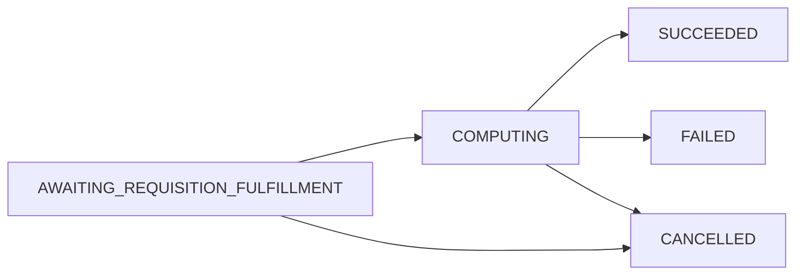

Measurements are the core resource in the Cross-Media Measurement API. This guide shows you how to create, monitor, and retrieve measurement results.

## Overview

A Measurement represents a privacy-preserving computation request from a MeasurementConsumer to one or more DataProviders. Measurements can compute:

- **Reach** - Unique users who saw an ad
- **Frequency** - Distribution of ad impressions per user
- **Impression Count** - Total number of ad impressions
- **Watch Duration** - Total time users spent watching video content
- **Population** - Population counts for demographic analysis

## Measurement Lifecycle

Measurements progress through the following states:



<AccordionGroup>
  <Accordion title="AWAITING_REQUISITION_FULFILLMENT">
    The measurement is waiting for all linked Requisitions to be fulfilled by DataProviders.
  </Accordion>
  
  <Accordion title="COMPUTING">
    All requisitions have been fulfilled and the computation is running.
  </Accordion>
  
  <Accordion title="SUCCEEDED">
    The measurement completed successfully. Results are available. This is a terminal state.
  </Accordion>
  
  <Accordion title="FAILED">
    The measurement failed. Check the `failure` field for details. This is a terminal state.
  </Accordion>
  
  <Accordion title="CANCELLED">
    The MeasurementConsumer cancelled the measurement. This is a terminal state.
  </Accordion>
</AccordionGroup>

## Creating a Measurement

Follow these steps to create a measurement:

<Steps>
  <Step title="Prepare your certificate">
    Ensure you have a valid certificate for signing the measurement specification.
    
    ```bash
    # Get your preferred certificate
    curl -X GET https://api.example.com/v2alpha/measurementConsumers/mc_abc123/certificates/preferred \
      -H "Authorization: Bearer YOUR_ID_TOKEN"
    ```
    
    See the [Certificates guide](/guides/certificates) for more information.
  </Step>
  
  <Step title="Define your measurement specification">
    Create a `MeasurementSpec` that defines what you want to measure:
    
    ```json
    {
      "measurementPublicKey": "BASE64_ENCODED_PUBLIC_KEY",
      "reach": {
        "privacyParams": {
          "epsilon": 0.01,
          "delta": 1e-12
        }
      },
      "vidSamplingInterval": {
        "start": 0.0,
        "width": 1.0
      }
    }
    ```
    
    <Tip>
      For reach and frequency measurements, configure privacy parameters (epsilon and delta) based on your privacy budget and accuracy requirements.
    </Tip>
  </Step>
  
  <Step title="Sign the measurement specification">
    Sign the serialized `MeasurementSpec` using your certificate's private key:
    
    1. Serialize the `MeasurementSpec` to protobuf binary format
    2. Sign the serialized bytes with your private key
    3. Create a `SignedMessage` containing the signature and serialized spec
    
    ```json
    {
      "message": "BASE64_ENCODED_SERIALIZED_MEASUREMENT_SPEC",
      "signature": "BASE64_ENCODED_SIGNATURE",
      "signatureAlgorithm": "ECDSA_P256_SHA256"
    }
    ```
  </Step>
  
  <Step title="Prepare DataProvider entries">
    For each DataProvider participating in the measurement, create an entry with:
    
    - DataProvider's certificate
    - DataProvider's public key for encryption
    - Encrypted requisition specification
    
    ```json
    {
      "dataProviders/dp_xyz789": {
        "dataProviderCertificate": "dataProviders/dp_xyz789/certificates/cert_001",
        "dataProviderPublicKey": {
          "@type": "type.googleapis.com/wfa.measurement.api.v2alpha.EncryptionPublicKey",
          "data": "BASE64_ENCODED_PUBLIC_KEY"
        },
        "encryptedRequisitionSpec": {
          "ciphertext": "BASE64_ENCODED_ENCRYPTED_SPEC",
          "typeUrl": "type.googleapis.com/wfa.measurement.api.v2alpha.RequisitionSpec"
        },
        "nonceHash": "SHA256_HASH_OF_NONCE"
      }
    }
    ```
  </Step>
  
  <Step title="Create the measurement">
    Call the `CreateMeasurement` API with all prepared data:
    
    ```bash
    curl -X POST https://api.example.com/v2alpha/measurementConsumers/mc_abc123/measurements \
      -H "Authorization: Bearer YOUR_ID_TOKEN" \
      -H "Content-Type: application/json" \
      -d '{
        "measurementConsumerCertificate": "measurementConsumers/mc_abc123/certificates/cert_001",
        "measurementSpec": {
          "message": "BASE64_ENCODED_SERIALIZED_MEASUREMENT_SPEC",
          "signature": "BASE64_ENCODED_SIGNATURE",
          "signatureAlgorithm": "ECDSA_P256_SHA256"
        },
        "dataProviders": {
          "dataProviders/dp_xyz789": {
            "dataProviderCertificate": "dataProviders/dp_xyz789/certificates/cert_001",
            "dataProviderPublicKey": {...},
            "encryptedRequisitionSpec": {...},
            "nonceHash": "..."
          }
        },
        "measurementReferenceId": "my-campaign-001"
      }'
    ```
    
    <Note>
      The `measurementReferenceId` is optional but recommended. Use it to reference the measurement in your external systems.
    </Note>
  </Step>
  
  <Step title="Receive measurement response">
    The API returns the created measurement:
    
    ```json
    {
      "name": "measurementConsumers/mc_abc123/measurements/meas_001",
      "state": "AWAITING_REQUISITION_FULFILLMENT",
      "measurementConsumerCertificate": "measurementConsumers/mc_abc123/certificates/cert_001",
      "measurementSpec": {...},
      "dataProviders": {...},
      "protocolConfig": {
        "liquidLegionsV2": {...}
      },
      "createTime": "2024-03-04T12:00:00Z",
      "updateTime": "2024-03-04T12:00:00Z"
    }
    ```
    
    Save the measurement name for polling and result retrieval.
  </Step>
</Steps>

## Monitoring Measurement Progress

After creating a measurement, monitor its progress:

### Polling for Updates

```bash
# Get current measurement state
curl -X GET https://api.example.com/v2alpha/measurementConsumers/mc_abc123/measurements/meas_001 \
  -H "Authorization: Bearer YOUR_ID_TOKEN"
```

### Listing Measurements with Filters

```bash
# List all computing measurements
curl -X GET "https://api.example.com/v2alpha/measurementConsumers/mc_abc123/measurements?filter.states=COMPUTING&filter.states=AWAITING_REQUISITION_FULFILLMENT" \
  -H "Authorization: Bearer YOUR_ID_TOKEN"
```

Available filters:
- `filter.states` - Filter by measurement state
- `filter.updatedAfter` - Measurements updated after a timestamp
- `filter.updatedBefore` - Measurements updated before a timestamp
- `filter.createdAfter` - Measurements created after a timestamp
- `filter.createdBefore` - Measurements created before a timestamp

### Batch Operations

<Tabs>
  <Tab title="Batch Get">
    Retrieve multiple measurements in a single request:
    
    ```bash
    curl -X POST https://api.example.com/v2alpha/measurementConsumers/mc_abc123/measurements:batchGet \
      -H "Authorization: Bearer YOUR_ID_TOKEN" \
      -H "Content-Type: application/json" \
      -d '{
        "names": [
          "measurementConsumers/mc_abc123/measurements/meas_001",
          "measurementConsumers/mc_abc123/measurements/meas_002",
          "measurementConsumers/mc_abc123/measurements/meas_003"
        ]
      }'
    ```
    
    <Note>
      Maximum of 50 measurements per batch request.
    </Note>
  </Tab>
  
  <Tab title="Batch Create">
    Create multiple measurements in a single request:
    
    ```bash
    curl -X POST https://api.example.com/v2alpha/measurementConsumers/mc_abc123/measurements:batchCreate \
      -H "Authorization: Bearer YOUR_ID_TOKEN" \
      -H "Content-Type: application/json" \
      -d '{
        "requests": [
          {"measurement": {...}},
          {"measurement": {...}},
          {"measurement": {...}}
        ]
      }'
    ```
    
    <Warning>
      All measurements must succeed or the entire batch fails. Maximum of 50 measurements per batch.
    </Warning>
  </Tab>
</Tabs>

## Retrieving Results

When a measurement reaches the `SUCCEEDED` state, results are available:

<Steps>
  <Step title="Check measurement state">
    Verify the measurement has succeeded:
    
    ```json
    {
      "name": "measurementConsumers/mc_abc123/measurements/meas_001",
      "state": "SUCCEEDED",
      "results": [
        {
          "certificate": "duchies/duchy_a/certificates/cert_001",
          "encryptedResult": {
            "ciphertext": "BASE64_ENCODED_ENCRYPTED_RESULT",
            "typeUrl": "type.googleapis.com/wfa.measurement.api.v2alpha.Measurement.Result"
          }
        }
      ]
    }
    ```
  </Step>
  
  <Step title="Decrypt the result">
    Decrypt the encrypted result using your measurement private key:
    
    1. Extract the `encryptedResult.ciphertext`
    2. Decrypt using your private key (corresponding to the `measurementPublicKey` in your spec)
    3. Deserialize the decrypted bytes to a `Measurement.Result` protobuf message
  </Step>
  
  <Step title="Verify the signature">
    Verify the result signature:
    
    1. Get the certificate specified in `results[].certificate`
    2. Verify the signature on the signed message
    3. Ensure the certificate chains to a trusted root
  </Step>
  
  <Step title="Extract measurement data">
    Parse the result based on the measurement type:
    
    **Reach Result:**
    ```json
    {
      "reach": {
        "value": 1234567,
        "noiseMechanism": "GEOMETRIC",
        "liquidLegionsV2": {...}
      }
    }
    ```
    
    **Frequency Result:**
    ```json
    {
      "frequency": {
        "relativeFrequencyDistribution": {
          "1": 0.30,
          "2": 0.25,
          "3": 0.20,
          "4": 0.15,
          "5": 0.10
        },
        "noiseMechanism": "GEOMETRIC"
      }
    }
    ```
  </Step>
</Steps>

## Cancelling Measurements

You can cancel a measurement before it completes:

```bash
curl -X POST https://api.example.com/v2alpha/measurementConsumers/mc_abc123/measurements/meas_001:cancel \
  -H "Authorization: Bearer YOUR_ID_TOKEN"
```

<Warning>
  Cancelled measurements cannot be restarted. The measurement transitions to the `CANCELLED` state, which is terminal.
</Warning>

## Handling Failures

When a measurement fails, check the `failure` field for details:

```json
{
  "name": "measurementConsumers/mc_abc123/measurements/meas_001",
  "state": "FAILED",
  "failure": {
    "reason": "REQUISITION_REFUSED",
    "message": "DataProvider dp_xyz789 refused requisition: INSUFFICIENT_PRIVACY_BUDGET"
  }
}
```

Failure reasons:

<AccordionGroup>
  <Accordion title="CERTIFICATE_REVOKED">
    A certificate used in the measurement was revoked. Update to a valid certificate and create a new measurement.
  </Accordion>
  
  <Accordion title="REQUISITION_REFUSED">
    A DataProvider refused to fulfill their requisition. Check the message for the specific justification. See the [Requisitions guide](/guides/requisitions) for details.
  </Accordion>
  
  <Accordion title="COMPUTATION_PARTICIPANT_FAILED">
    A Duchy participating in the computation failed. This may be transient - retry the measurement.
  </Accordion>
</AccordionGroup>

## Best Practices

<CardGroup cols={2}>
  <Card title="Use Request IDs" icon="fingerprint">
    Include a unique `requestId` in CreateMeasurement calls for idempotency. This prevents duplicate measurements if you retry a request.
  </Card>
  
  <Card title="Reference IDs" icon="tag">
    Always set `measurementReferenceId` to link measurements to your internal campaign tracking.
  </Card>
  
  <Card title="Monitor Privacy Budget" icon="gauge">
    Work with DataProviders to understand privacy budget constraints. Failed measurements due to insufficient budget still consume budget.
  </Card>
  
  <Card title="Batch When Possible" icon="layer-group">
    Use batch operations for multiple measurements to reduce API calls and improve efficiency.
  </Card>
</CardGroup>

## Next Steps

<CardGroup cols={2}>
  <Card title="Requisitions" icon="list-check" href="/guides/requisitions">
    Learn how DataProviders fulfill requisitions
  </Card>
  
  <Card title="Panel Matching" icon="users" href="/guides/panel-matching">
    Understand panel matching protocols
  </Card>
  
  <Card title="API Reference" icon="book" href="/api/measurements">
    View the complete API reference
  </Card>
</CardGroup>
