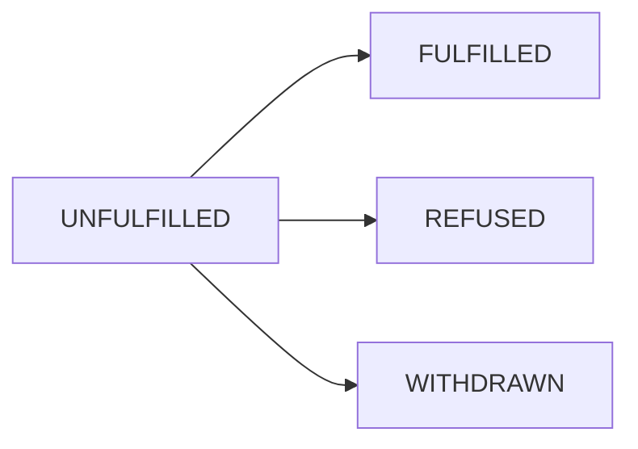

Requisitions are work requests created for DataProviders to fulfill measurements. This guide explains how requisitions work and how DataProviders fulfill them.

## Overview

A Requisition is created on behalf of a MeasurementConsumer to instruct a DataProvider to collect and upload data necessary to compute a Measurement result.

Key characteristics:
- **Automatic creation** - Created automatically when a Measurement is created
- **One per DataProvider** - Each participating DataProvider gets one requisition per measurement
- **Output-only** - Cannot be directly created; only retrieved and fulfilled
- **State-driven** - Progress through well-defined states

## Requisition Resource

Requisitions have two resource name patterns:

```bash
# DataProvider view (canonical)
dataProviders/{data_provider}/requisitions/{requisition}

# MeasurementConsumer view
measurementConsumers/{measurement_consumer}/measurements/{measurement}/requisitions/{requisition}
```

<Tip>
  DataProviders should use the canonical format. MeasurementConsumers can list requisitions under their measurements to monitor progress.
</Tip>

## Requisition Lifecycle

Requisitions progress through the following states:



<AccordionGroup>
  <Accordion title="UNFULFILLED" icon="clock">
    The requisition has been created but not yet fulfilled by the DataProvider. This is the initial state.
    
    **Actions available:**
    - Fulfill the requisition
    - Refuse the requisition
  </Accordion>
  
  <Accordion title="FULFILLED" icon="check">
    The DataProvider has successfully fulfilled the requisition. Terminal state.
    
    **Result:**
    - Data has been uploaded
    - Parent measurement can proceed to computation
  </Accordion>
  
  <Accordion title="REFUSED" icon="xmark">
    The DataProvider has refused to fulfill the requisition. Terminal state.
    
    **Result:**
    - Parent measurement transitions to FAILED state
    - Refusal details are recorded in the `refusal` field
  </Accordion>
  
  <Accordion title="WITHDRAWN" icon="arrow-rotate-left">
    The requisition has been withdrawn. Terminal state.
    
    **Cause:**
    - Parent measurement was cancelled
    - Another requisition for the same measurement failed
  </Accordion>
</AccordionGroup>

## Listing Requisitions

DataProviders can list their requisitions to find work:

<Tabs>
  <Tab title="List for DataProvider">
    Get all requisitions for your DataProvider:
    
    ```bash
    curl -X GET https://api.example.com/v2alpha/dataProviders/dp_abc123/requisitions \
      -H "Authorization: Bearer YOUR_ID_TOKEN"
    ```
    
    Response:
    ```json
    {
      "requisitions": [
        {
          "name": "dataProviders/dp_abc123/requisitions/req_001",
          "state": "UNFULFILLED",
          "measurement": "measurementConsumers/mc_xyz/measurements/meas_001",
          "measurementSpec": {...},
          "encryptedRequisitionSpec": {...}
        }
      ]
    }
    ```
  </Tab>
  
  <Tab title="List for Measurement">
    MeasurementConsumers can list requisitions for a specific measurement:
    
    ```bash
    curl -X GET "https://api.example.com/v2alpha/measurementConsumers/mc_xyz/measurements/meas_001/requisitions" \
      -H "Authorization: Bearer YOUR_ID_TOKEN"
    ```
    
    This helps monitor which DataProviders have fulfilled their requisitions.
  </Tab>
  
  <Tab title="Filter by State">
    Filter requisitions by state:
    
    ```bash
    # Get only unfulfilled requisitions
    curl -X GET "https://api.example.com/v2alpha/dataProviders/dp_abc123/requisitions?filter.states=UNFULFILLED" \
      -H "Authorization: Bearer YOUR_ID_TOKEN"
    ```
    
    Available states:
    - `UNFULFILLED`
    - `FULFILLED`
    - `REFUSED`
    - `WITHDRAWN`
  </Tab>
</Tabs>

## Fulfilling Requisitions

DataProviders fulfill requisitions by providing the requested measurement data.

### Understanding the Requisition

Before fulfilling, examine the requisition contents:

<Steps>
  <Step title="Get the requisition">
    ```bash
    curl -X GET https://api.example.com/v2alpha/dataProviders/dp_abc123/requisitions/req_001 \
      -H "Authorization: Bearer YOUR_ID_TOKEN"
    ```
  </Step>
  
  <Step title="Check the measurement spec">
    The `measurementSpec` field contains:
    - What type of measurement is requested (reach, frequency, etc.)
    - Privacy parameters (epsilon, delta)
    - VID sampling interval
    
    Verify the signature using `measurementConsumerCertificate`.
  </Step>
  
  <Step title="Decrypt the requisition spec">
    The `encryptedRequisitionSpec` contains:
    - Event date range
    - Event filters
    - EventGroup specifications
    
    Decrypt using your DataProvider private key:
    ```python
    # Decrypt requisition spec
    decrypted_spec = decrypt(
        encrypted_requisition_spec.ciphertext,
        data_provider_private_key
    )
    
    # Parse the RequisitionSpec
    requisition_spec = RequisitionSpec.parse(decrypted_spec)
    ```
  </Step>
  
  <Step title="Check protocol config">
    The `protocolConfig` specifies the computation protocol:
    - `Direct` - DataProvider computes result directly
    - `LiquidLegionsV2` - Multi-party computation protocol
    - `ReachOnlyLiquidLegionsV2` - Optimized for reach-only
    - `HonestMajorityShareShuffle` - Alternative MPC protocol
  </Step>
</Steps>

### Fulfilling with Direct Protocol

For the Direct protocol, DataProviders compute and upload results directly:

<Steps>
  <Step title="Query your data">
    Based on the decrypted requisition spec:
    
    ```sql
    -- Example: Count distinct users for reach measurement
    SELECT COUNT(DISTINCT virtual_id) as reach
    FROM events
    WHERE event_group_id IN ('eg_1', 'eg_2')
      AND event_time BETWEEN '2024-01-01' AND '2024-01-31'
      AND virtual_id_hash >= sampling_start
      AND virtual_id_hash < sampling_end
    ```
  </Step>
  
  <Step title="Apply privacy mechanisms">
    Add differential privacy noise:
    
    ```python
    import numpy as np
    
    def add_laplace_noise(true_value, epsilon):
        # Laplace mechanism for differential privacy
        sensitivity = 1.0
        scale = sensitivity / epsilon
        noise = np.random.laplace(0, scale)
        return max(0, true_value + noise)  # Clamp to non-negative
    
    noisy_reach = add_laplace_noise(raw_reach, epsilon=0.01)
    ```
  </Step>
  
  <Step title="Create the result">
    Build a `Measurement.Result` message:
    
    ```json
    {
      "reach": {
        "value": 1234567,
        "noiseMechanism": "LAPLACE",
        "customDirectMethodology": {
          "variance": 1000.0
        }
      }
    }
    ```
  </Step>
  
  <Step title="Sign the result">
    Sign the serialized result with your DataProvider certificate:
    
    ```python
    # Serialize result to protobuf
    serialized_result = result.SerializeToString()
    
    # Sign with private key
    signature = sign_with_private_key(
        serialized_result,
        data_provider_private_key,
        algorithm="ECDSA_P256_SHA256"
    )
    
    # Create SignedMessage
    signed_message = SignedMessage(
        message=serialized_result,
        signature=signature,
        signature_algorithm="ECDSA_P256_SHA256"
    )
    ```
  </Step>
  
  <Step title="Encrypt the result">
    Encrypt the signed result using the measurement public key:
    
    ```python
    # Get measurement public key from measurement_spec
    measurement_public_key = extract_public_key(measurement_spec)
    
    # Encrypt signed result
    encrypted_result = encrypt(
        signed_message.SerializeToString(),
        measurement_public_key
    )
    ```
  </Step>
  
  <Step title="Fulfill the requisition">
    Call the `FulfillDirectRequisition` API:
    
    ```bash
    curl -X POST https://api.example.com/v2alpha/dataProviders/dp_abc123/requisitions/req_001:fulfillDirect \
      -H "Authorization: Bearer YOUR_ID_TOKEN" \
      -H "Content-Type: application/json" \
      -d '{
        "encryptedResult": {
          "ciphertext": "BASE64_ENCODED_ENCRYPTED_RESULT",
          "typeUrl": "type.googleapis.com/wfa.measurement.api.v2alpha.Measurement.Result"
        },
        "nonce": 1234567890123456,
        "certificate": "dataProviders/dp_abc123/certificates/cert_001",
        "etag": "CURRENT_REQUISITION_ETAG"
      }'
    ```
    
    <Note>
      The `nonce` must match the nonce value from `encryptedRequisitionSpec`. The `etag` ensures optimistic concurrency control.
    </Note>
  </Step>
</Steps>

### Fulfillment Context

Optionally provide context about the fulfillment:

```json
{
  "fulfillmentContext": {
    "buildLabel": "edp-v1.2.3",
    "warnings": [
      "Some events were outside data availability window",
      "Applied minimum threshold of k=10 for privacy"
    ]
  }
}
```

## Refusing Requisitions

If you cannot fulfill a requisition, refuse it with a justification:

<Steps>
  <Step title="Determine justification">
    Choose the appropriate refusal justification:
    
    <AccordionGroup>
      <Accordion title="CONSENT_SIGNAL_INVALID">
        A cryptographic consent signal (signature or encrypted value) is invalid.
        
        **Examples:**
        - Signature cannot be verified
        - Encrypted spec cannot be decrypted
        - Certificate is not trusted
      </Accordion>
      
      <Accordion title="SPEC_INVALID">
        The requisition specification is invalid.
        
        **Examples:**
        - Invalid date range (end before start)
        - Unsupported configuration
        - Malformed event filters
      </Accordion>
      
      <Accordion title="INSUFFICIENT_PRIVACY_BUDGET">
        There is not enough remaining privacy budget to fulfill the requisition.
        
        **Examples:**
        - Too many recent measurements on the same data
        - Epsilon/delta requirements exceed available budget
        - Cumulative privacy loss too high
      </Accordion>
      
      <Accordion title="UNFULFILLABLE">
        The requisition cannot be fulfilled for an unspecified reason.
        
        **Examples:**
        - Data corruption
        - System failure
        - Unexpected error in processing
      </Accordion>
      
      <Accordion title="DECLINED">
        The DataProvider has declined to fulfill this requisition.
        
        **Examples:**
        - Policy violation
        - Business decision
        - Contractual restrictions
      </Accordion>
    </AccordionGroup>
  </Step>
  
  <Step title="Refuse the requisition">
    Call the `RefuseRequisition` API:
    
    ```bash
    curl -X POST https://api.example.com/v2alpha/dataProviders/dp_abc123/requisitions/req_001:refuse \
      -H "Authorization: Bearer YOUR_ID_TOKEN" \
      -H "Content-Type: application/json" \
      -d '{
        "refusal": {
          "justification": "INSUFFICIENT_PRIVACY_BUDGET",
          "message": "Privacy budget depleted for this event group. Next reset: 2024-04-01."
        },
        "etag": "CURRENT_REQUISITION_ETAG"
      }'
    ```
    
    <Warning>
      Refusing a requisition causes the parent measurement to **fail permanently**. Only refuse for permanent failures, not transient errors.
    </Warning>
  </Step>
</Steps>

## Optimistic Concurrency Control

Requisitions use ETags to prevent concurrent modifications:

```bash
# Get current requisition with ETag
GET /dataProviders/dp_abc123/requisitions/req_001

Response:
{
  "name": "dataProviders/dp_abc123/requisitions/req_001",
  "state": "UNFULFILLED",
  "etag": "W/\"abc123\""  # Current ETag
}

# Include ETag when fulfilling
POST /dataProviders/dp_abc123/requisitions/req_001:fulfillDirect
{
  "etag": "W/\"abc123\"",  # Must match current ETag
  ...
}
```

<Note>
  If the ETag doesn't match, you'll receive an `ABORTED` error. Retrieve the latest requisition and retry.
</Note>

## Duchy Information

For multi-party computation protocols, the `duchies` field contains duchy-specific information:

```json
{
  "duchies": {
    "duchies/duchy_a": {
      "duchyCertificate": "duchies/duchy_a/certificates/cert_001",
      "liquidLegionsV2": {
        "elGamalPublicKey": {
          "message": "...",
          "signature": "..."
        }
      }
    },
    "duchies/duchy_b": {
      "duchyCertificate": "duchies/duchy_b/certificates/cert_002",
      "liquidLegionsV2": {
        "elGamalPublicKey": {
          "message": "...",
          "signature": "..."
        }
      }
    }
  }
}
```

Use this information when fulfilling requisitions for MPC protocols.

## Best Practices

<CardGroup cols={2}>
  <Card title="Poll Regularly" icon="rotate">
    Poll for new UNFULFILLED requisitions regularly (e.g., every 30 seconds) to minimize measurement latency.
  </Card>
  
  <Card title="Validate Before Fulfilling" icon="check">
    Always validate signatures and decrypt specs before starting computation. Catch errors early.
  </Card>
  
  <Card title="Use ETags" icon="tag">
    Always include the current ETag when fulfilling or refusing requisitions to prevent race conditions.
  </Card>
  
  <Card title="Provide Context" icon="message">
    Include fulfillment context with build labels and warnings to aid debugging.
  </Card>
  
  <Card title="Monitor Privacy Budget" icon="gauge">
    Track privacy budget consumption and refuse requisitions proactively when budget is low.
  </Card>
  
  <Card title="Refuse Permanently Only" icon="exclamation-triangle">
    Only refuse requisitions for permanent failures. For transient errors, retry or contact the MeasurementConsumer.
  </Card>
</CardGroup>

## Troubleshooting

<AccordionGroup>
  <Accordion title="Cannot decrypt requisition spec">
    **Possible causes:**
    - Wrong private key
    - Corrupted ciphertext
    - Mismatched encryption algorithm
    
    **Solutions:**
    - Verify you're using the correct DataProvider private key
    - Check that the public key in the measurement matches your certificate
    - Ensure encryption/decryption algorithms are compatible
  </Accordion>
  
  <Accordion title="Signature verification fails">
    **Possible causes:**
    - Certificate mismatch
    - Tampered data
    - Wrong signature algorithm
    
    **Solutions:**
    - Verify the certificate chains to a trusted root
    - Check that the certificate hasn't been revoked
    - Ensure you're using the correct signature verification algorithm
  </Accordion>
  
  <Accordion title="ABORTED error when fulfilling">
    **Cause:**
    ETag doesn't match current requisition state.
    
    **Solution:**
    Re-fetch the requisition to get the latest ETag and retry.
  </Accordion>
</AccordionGroup>

## Next Steps

<CardGroup cols={2}>
  <Card title="Creating Measurements" icon="chart-line" href="/guides/creating-measurements">
    Learn how MeasurementConsumers create measurements
  </Card>
  
  <Card title="Panel Matching" icon="users" href="/guides/panel-matching">
    Understand panel matching for multi-party measurements
  </Card>
  
  <Card title="API Reference" icon="book" href="/api/requisitions">
    View the complete Requisitions API reference
  </Card>
</CardGroup>
