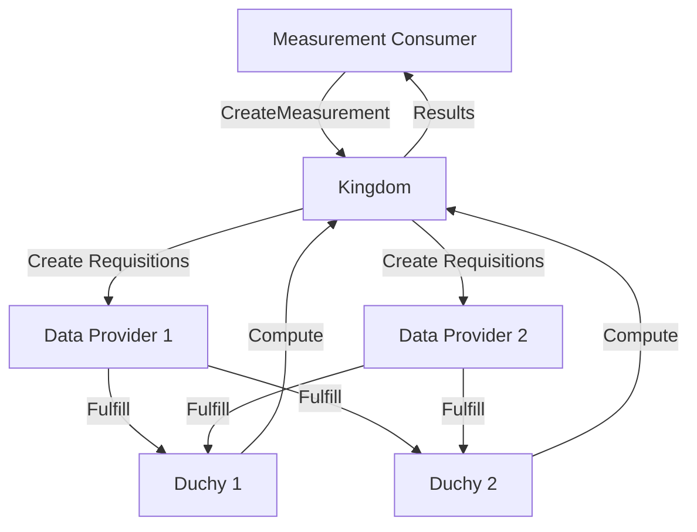

## What is the Cross-Media Measurement API?

The Cross-Media Measurement API is a comprehensive gRPC-based API that enables privacy-preserving measurement and audience analytics across multiple data providers. Built on Protocol Buffers, this API allows measurement consumers (such as advertisers and agencies) to compute reach, frequency, impressions, and other metrics without accessing raw user-level data.

<Note>
  The API implements multi-party computation (MPC) protocols and differential privacy techniques to ensure that individual user data remains private throughout the measurement process.
</Note>

## Key Capabilities

The Cross-Media Measurement API provides a complete ecosystem for privacy-preserving measurements:

<CardGroup cols={2}>
  <Card title="Privacy-First Measurements" icon="shield-halved">
    Compute reach, frequency, impressions, and watch duration metrics using multi-party computation without exposing raw user data.
  </Card>
  <Card title="Cross-Provider Analytics" icon="chart-line">
    Measure campaigns across multiple data providers (publishers, panel providers) in a unified, privacy-preserving way.
  </Card>
  <Card title="Differential Privacy" icon="lock">
    Built-in differential privacy parameters protect individual user privacy while maintaining statistical accuracy.
  </Card>
  <Card title="Certificate-Based Security" icon="certificate">
    X.509 certificate-based authentication and digital signatures ensure secure, verifiable communication.
  </Card>
</CardGroup>

## Core Use Cases

### Measurement Consumer Workflows

As a **Measurement Consumer** (advertiser or agency), you can:

- **Create measurements** that compute reach and frequency across multiple publishers
- **Track campaign performance** without accessing individual user data
- **Manage event groups** to organize and categorize campaign events
- **Configure differential privacy** parameters to balance privacy and accuracy

### Data Provider Workflows

As a **Data Provider** (publisher or panel provider), you can:

- **Fulfill requisitions** by providing encrypted data for measurement computations
- **Manage event groups** representing campaigns or content in your system
- **Control data availability** windows for measurement participation
- **Participate in panel matching** to enable cross-provider analytics

### Model Provider Workflows

As a **Model Provider**, you can:

- **Manage VID (Virtual ID) models** that enable user matching across providers
- **Deploy model releases** and control rollouts across the ecosystem
- **Monitor model performance** and handle outages

## Architecture Overview

The Cross-Media Measurement API follows a resource-oriented design based on [Google API Improvement Proposals (AIPs)](https://google.aip.dev/), with these key differences:

<Warning>
  This API is **gRPC-only** and does not provide HTTP/REST endpoints. All communication uses Protocol Buffers over gRPC.
</Warning>

### Key Components

1. **Kingdom** - The central coordination service that manages resources and orchestrates measurements
2. **Duchies** - Independent computation nodes that perform multi-party computation without seeing raw data
3. **Data Providers (EDPs)** - Event Data Providers that contribute encrypted event data
4. **Measurement Consumers** - Entities that request and receive measurement results



## Privacy Guarantees

The API implements multiple layers of privacy protection:

### Multi-Party Computation (MPC)

Measurements are computed using MPC protocols including:

- **Liquid Legions v2** - For reach and frequency measurements
- **Honest Majority Share Shuffle (HMSS)** - For efficient computation with honest majority assumptions
- **Deterministic protocols** - For direct computation scenarios

<Note>
  MPC ensures that no single party (including Duchies) can see raw user-level data. Each Duchy only processes encrypted shares of the data.
</Note>

### Differential Privacy

All measurements apply differential privacy to add calibrated noise to results:

```protobuf
message DifferentialPrivacyParams {
  double epsilon = 1;  // Privacy budget
  double delta = 2;    // Failure probability
}
```

This prevents inference attacks even when multiple measurements are combined.

### Certificate-Based Trust

X.509 certificates establish trust and enable:

- **Digital signatures** on measurement specifications
- **Encryption** of sensitive data with public keys
- **Verification** that data comes from authorized parties

## API Design Principles

### Resource-Oriented

The API centers around well-defined resources with clear relationships:

- **MeasurementConsumer** - Consumer of measurement results
- **DataProvider** - Provider of event data
- **Measurement** - A requested computation
- **Requisition** - A request for data from a DataProvider
- **EventGroup** - A collection of related events
- **Certificate** - An X.509 certificate for authentication

### Immutable Specifications

Key specifications like `MeasurementSpec` and `RequisitionSpec` are immutable and signed to ensure integrity throughout the measurement lifecycle.

### Structured Filters

Instead of using the AIP-160 filtering language, the API uses structured filter messages:

```protobuf
message Filter {
  repeated State states = 1;
  google.protobuf.Timestamp updated_after = 2;
  google.protobuf.Timestamp updated_before = 3;
}
```

## Getting Started

<Steps>
  <Step title="Understand Core Concepts">
    Read the [Concepts](/concepts) page to learn about the resource model, measurements, and privacy guarantees.
  </Step>
  
  <Step title="Set Up Authentication">
    Follow the [Authentication Guide](/guides/authentication) to create an account and obtain certificates.
  </Step>
  
  <Step title="Create Your First Measurement">
    Use the [Quickstart](/quickstart) to make your first API call and create a measurement.
  </Step>
  
  <Step title="Explore the API">
    Browse the [API Reference](/api/overview) to discover all available services and methods.
  </Step>
</Steps>

## Community and Support

The Cross-Media Measurement API is developed by the [World Federation of Advertisers](https://wfanet.org/) as part of the Halo project.

<CardGroup cols={2}>
  <Card title="GitHub Repository" icon="github" href="https://github.com/world-federation-of-advertisers/cross-media-measurement-api">
    View source code, file issues, and contribute to the project.
  </Card>
  <Card title="API Reference" icon="book" href="/api/overview">
    Comprehensive reference for all services, resources, and methods.
  </Card>
</CardGroup>

## Next Steps

Ready to start building? Here are some recommended paths:

- **New to the API?** Start with the [Quickstart Guide](/quickstart)
- **Want to understand the architecture?** Read [Core Concepts](/concepts)
- **Ready to create measurements?** See [Creating Measurements](/guides/creating-measurements)
- **Need to set up authentication?** Follow the [Authentication Guide](/guides/authentication)
